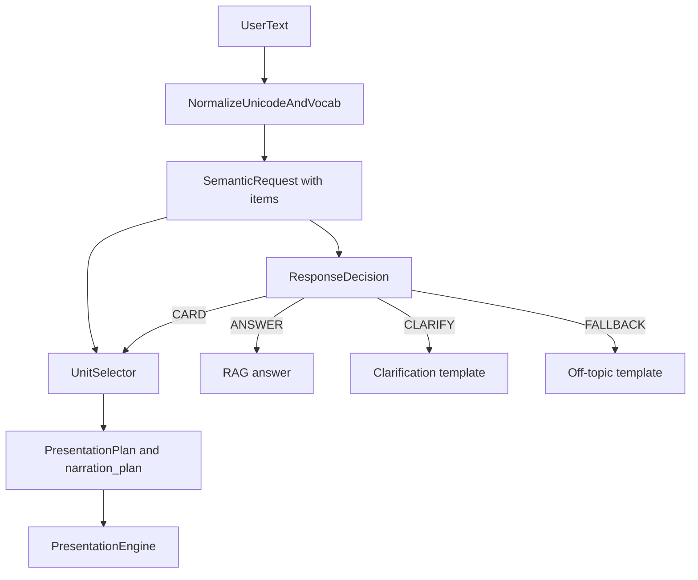

# M5.4 Final Authority Map

State of the semantic stack **after** the M5.4 cleanup. This supersedes the Phase 1 survey in
[M5_4_SEMANTIC_AUTHORITY_MAP.md](./M5_4_SEMANTIC_AUTHORITY_MAP.md), which recorded the
pre-cleanup collisions.

No LLM participates in routing, identity, topic selection, or unitIds.

---

## 1. One owner per decision

| Decision | Sole owner | Everyone else |
|---|---|---|
| Is this turn a card, an answer, a clarification, or a refusal? | `resolve_response_decision` — [response_decision.py](../backend/services/conversation/response_decision.py) | consumers |
| Which departments is the user talking about? | `match_department_spans_exclusive` — [department_identity.py](../backend/services/content/department_identity.py) | consumers |
| Which topics, and where in the sentence? | `detect_topic_spans` — [semantic_composition.py](../backend/services/content/semantic_composition.py) | consumers |
| Which entity pairs with which topic? | `pair_entities_and_topics` — [semantic_composition.py](../backend/services/content/semantic_composition.py) | consumers |
| What is the language-independent request? | `parse_semantic_request` — [semantic_request_parser.py](../backend/services/content/semantic_request_parser.py) | consumers |
| Which content units exist for this turn, in what order? | `select_content_units` — [unit_selector.py](../backend/services/content/unit_selector.py) | **only writer of `unitId`** |
| Which card surface is named on the wire? | `select_surface` — [surface_selector.py](../backend/services/content/surface_selector.py), then gated by the unit plan | consumers |
| What is narrated per unit? | `resolve_narration` — [narration_resolver.py](../backend/services/orchestration/narration_resolver.py) | consumers |
| May a previous turn's department enter this turn? | `has_anaphora` — [semantic_anaphora.py](../backend/services/content/semantic_anaphora.py) | consumers |

---

## 2. Flow

`parse_semantic_request` runs before the decision because a resolved request **is** the card
evidence. It is still the parser, not the router: it never names a surface and never writes a
`unitId`.

---

## 3. Backend classification after cleanup

| Path | Class | Note |
|---|---|---|
| `resolve_response_decision` | **AUTHORITATIVE** | The only place `CARD / ANSWER / CLARIFY / FALLBACK` is chosen |
| `parse_semantic_request` | **AUTHORITATIVE** | Entity+topic binding; returns `None` rather than guessing |
| `select_content_units` | **AUTHORITATIVE** | Iterates `SemanticRequest.items`; the only `unitId` writer |
| `match_department_spans_exclusive` | **AUTHORITATIVE** | Exclusive longest span; `cse` can never leak out of `cse_ds` |
| `detect_topic_spans` | **AUTHORITATIVE** | Positional topics, which is what makes pairing possible |
| `has_anaphora` | **AUTHORITATIVE** | The only door through which a prior entity enters a turn |
| `route_policy` | **CONSUMER** | Projects `ResponseDecision` onto `PolicyAction`; decides nothing itself |
| `resolve_presentation` | **CONSUMER** | Applies the surface, then lets the unit plan confirm or drop it |
| `resolve_narration` | **CONSUMER** | Emits exactly the plan's units; returns `None` when unresolved |
| `select_surface` | **CONSUMER** | Names a surface for an already-authorised card turn |
| `score_intent_from_features` | **CONSUMER / observability** | Token count removed; confidence no longer routes |
| `extract_features` / `resolve_intent_from_features` | **RETAINED, non-department** | Bus, documents, intra-SVIT comparison, FAQ, policy. Cannot open a department card |
| `normalize_and_classify_query` (Groq) | **UTILITY** | Translation for answer generation. Never mode, entity, topic, or unitId |
| `maybe_override_intent_with_executive_profile` | **CONSUMER** | Called from inside `ResponseDecision`, not from the shell |
| `_llm_detect_broad_course_intent` | **REMOVED** | Deleted; was a card writer |
| `_llm_resolve_department_comparison_spec` | **DEMOTED** | May only refine highlight/focus of an already-chosen comparison |

---

## 4. Frontend classification after cleanup

| Symbol | Class | Note |
|---|---|---|
| `normalizeCardTrigger(payload.showCard)` | **CONSUMER** | The only card trigger on voice/typed turns |
| `presentationCardsFromNarrationSegments` | **CONSUMER** | One model per `unitId`, order preserved |
| `buildDepartmentSlideForUnit` | **CONSUMER** | Resolves each unit against **its own** department |
| `localIntent` | **RETAINED, UI only** | Sent from explicit clicks (`source === 'UI'`) |
| `uiClickDeckDepartmentRef` | **RETAINED, UI only** | A unit-less deck may open only for an actual menu click |
| `inferForcedDepartmentComparisonFromUserText` | **REMOVED** | File `departmentComparisonIntent.ts` deleted |
| `inferForcedBusRoutesFromUserText` | **REMOVED** | File `busRoutesIntent.ts` deleted |
| `inferExecutiveProfileFromUserText` | **REMOVED** | `executiveLeadershipIntent.ts` now exports only the render kind |
| Trustees keyword regex in the WS handler | **REMOVED** | Trustees open from `showCard` or an explicit `TRUSTEES_UI` event |
| Legacy five-slide builder | **GATED** | Voice turn without unitIds renders no card |

---

## 5. Retained non-unit card surfaces

These are legitimate cards that `UnitSelector` does not own. They are listed in
[M5_4_CARD_TRIGGER_REGISTRY.md](./M5_4_CARD_TRIGGER_REGISTRY.md) and remain owned by
`extract_features` → `select_surface`, downstream of the response decision:

principal, vice-principal, trustees, course menu, admissions, documents, bus routes,
college overview, placements, intra-SVIT department comparison.

---

## 6. Leftover sweep

Repo-wide search for `maxHod`, `slice(0, 2)`, `inferForced*`, five-slide builders, department
card triggers, and `unitId` writers. Every remaining hit is classified.

| Hit | Where | Verdict |
|---|---|---|
| `inferForced*`, five-slide, `maxHod` | `docs/M5_3_*`, `docs/M5_4_RECEPTIONIST_INTELLIGENCE_FORENSIC.md`, `docs/M5_4_SEMANTIC_AUTHORITY_MAP.md` | **Historical record.** These documents describe the pre-cleanup state and are cited as inputs by the plan. Not code. |
| `slice(0, 3)` on comparison departments | comparison cinema | **Retained.** The comparison card renders at most three columns by design; it is not a unit path. |
| `select_surface` fallback in [main.py](../backend/app/main.py) | post-orchestrator | **Gated.** Runs only when the decision said CARD, or when there is no decision *and* the user clicked. |
| Legacy deck builder in `ChatScreen` | `department_overview` branch | **Gated.** Requires `uiClickDeckDepartmentRef`, set only by `handleCourseMenuSelect`. |
| `buildDepartmentSlidesFromRecord` | `collegeLocaleUtils` | **Retained.** Still correct for the single-department menu-click deck; mixed decks go through `buildDepartmentSlideForUnit`. |
| `extract_features` department branches | `answer_generation` | **Retained but powerless.** They can no longer open a card: `resolve_presentation` only cards on `PolicyAction.CARD_PRESENTATION`, and the unit plan confirms or drops the surface. |

---

## 7. Invariants a future change must not break

1. `unitId` is written in exactly one function.
2. A department card requires a validated department. There is no nearest match, no first
   department, and no default deck.
3. A CARD turn without units emits no card, on the wire and in the UI.
4. Utterance length is never evidence of intent.
5. Naming two departments is not a comparison; a contrast cue is required.
6. FALLBACK copy and "answer unavailable" copy are different sentences.
7. A prior turn's entity enters only through an anaphor.
