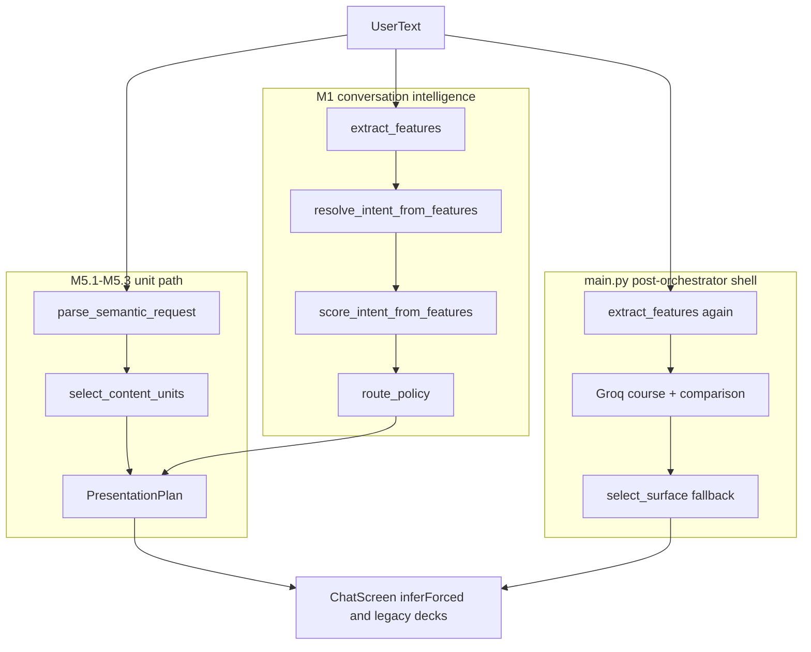

# M5.4 Phase 1 — Current Semantic Authority Map

Read-only survey performed 2026-08-18 before any M5.4 change. Nothing was deleted or modified
in this phase. Every path below is classified as:

| Class | Meaning |
|---|---|
| **AUTHORITATIVE** | Intended single owner of a decision. Keep. |
| **CONSUMER** | Reads a decision made elsewhere. Keep, must not decide. |
| **LEGACY FALLBACK** | Older path still reachable when the authoritative path yields nothing. |
| **COMPETING** | Can overrule or contradict the authoritative owner. Must be demoted. |
| **OBSOLETE CANDIDATE** | Dead or unreachable. Remove after proof. |
| **UTILITY** | Pure helper, no decision authority. |

---

## 0. The core problem in one picture

Today two pipelines decide the same turn, and a third shell can rewrite the result.

There is **no** `response_mode`. "Card or not" is inferred from `PolicyAction` plus surface
selection plus a Groq override plus a frontend inference.

---

## 1. Backend — semantic request / unit path

| Path | File:line | Class | Note |
|---|---|---|---|
| `parse_semantic_request` | [semantic_request_parser.py:40](../backend/services/content/semantic_request_parser.py) | AUTHORITATIVE (entity+topic for cards) | Fail-closes `len(atomic) >= 2` at :82, and `topic != HOD and len(entities) > 1` at :95 and :110 |
| `SemanticRequest` | [semantic_request.py:12](../backend/services/content/semantic_request.py) | AUTHORITATIVE (contract) | Single `topic` + `entities` tuple. Cannot express mixed pairs |
| `select_content_units` | [unit_selector.py:48](../backend/services/content/unit_selector.py) | AUTHORITATIVE (sole unitId writer) | HOD loops entities (:85-91); every other topic uses `entities[0]` (:79, :95) |
| `PresentationPlan` | [presentation_plan.py:11](../backend/services/presentation/presentation_plan.py) | CONSUMER | Carries `unit_ids` + surface |
| `build_full_department_plan` | [presentation_plan_builder.py:69](../backend/services/presentation/presentation_plan_builder.py) | LEGACY FALLBACK | Second construction site of `PresentationPlan` |
| `content_unit_registry` | [content_unit_registry.py](../backend/services/content/content_unit_registry.py) | AUTHORITATIVE (unit catalogue) | `{dept}.{overview,hod,achievements,placements,fees}` + 3 context units |

## 2. Backend — entity authority

| Path | File:line | Class | Note |
|---|---|---|---|
| `match_department_keys_exclusive` | [department_identity.py:69](../backend/services/content/department_identity.py) | AUTHORITATIVE | Longest-span, occupancy-consuming. `cse` cannot leak out of `cse_ds` |
| `resolve_department_key` | [department_resolver.py:55](../backend/services/content/department_resolver.py) | AUTHORITATIVE (validation) | Confirms a matched key is real |
| `_inject_regional_department_tokens` | [answer_generation.py:1853](../backend/services/answer_generation.py) | UTILITY (vocab) | Kannada DS injected; **native Hindi DS missing** — the M5.3 Hindi drop |
| `extract_features` department block | [answer_generation.py:1590-1621](../backend/services/answer_generation.py) | **COMPETING** | Fuzzy `ratio > 0.7` over tokens and 1-3-grams, first-match ordering |
| `extract_entities` `DEPARTMENT_KEYWORDS` | [answer_generation.py:2068](../backend/services/answer_generation.py) | **COMPETING** | First matching dict key wins |
| `normalizeDepartmentMenuKey` / `menuLabelToJsonKey` | [ChatScreen.tsx:429](../frontend/src/screens/ChatScreen.tsx), [collegeLocaleUtils.ts:139](../frontend/src/lib/collegeLocaleUtils.ts) | LEGACY FALLBACK | Frontend dept resolution for legacy decks |

## 3. Backend — topic authority

| Path | File:line | Class | Note |
|---|---|---|---|
| `detect_atomic_topics` | [semantic_topics.py:48](../backend/services/content/semantic_topics.py) | AUTHORITATIVE | Vocab-driven, word-boundary safe, **not** first-keyword-wins. Returns an unordered set — no spans, so pairing is impossible today |
| `is_full_department_scope` | [semantic_topics.py:72](../backend/services/content/semantic_topics.py) | AUTHORITATIVE | Scope cue |
| `normalize_semantic_topic` | [semantic_normalize.py:62](../backend/services/conversation/semantic_normalize.py) | **COMPETING** | Separate keyword topic list incl. `FOOD` / `ENVIRONMENT` |
| `UNSUPPORTED_TOPICS` | [semantic_normalize.py:8](../backend/services/conversation/semantic_normalize.py) | **COMPETING** | `FOOD`/`ENVIRONMENT` force `UNKNOWN` in 4 different files |
| `extract_features` topic flags | [answer_generation.py:1638-1677](../backend/services/answer_generation.py) | **COMPETING** | Course `>= 0.7`, documents `>= 0.7`, placements phrase list, comparison cue list |
| `resolve_intent_from_features` | [answer_generation.py:2081](../backend/services/answer_generation.py) | **COMPETING** (cards) / AUTHORITATIVE (bus, documents, FAQ, policy) | Fixed priority ladder; `has_department` alone yields `DEPARTMENT_OVERVIEW` |

### 3.1 Proven topic thefts

| Utterance | Stolen by | Mechanism |
|---|---|---|
| `What is the capital of France?` | `COURSE_MENU` | `france` vs `branches` fuzzy 0.714 >= 0.7 |
| `Do students get opportunities?` | `DOCUMENTS` | `do students` vs `documents` 0.737 >= 0.7 |
| `How are placements?` | `DEPARTMENT_COMPARISON` | `" placements "` is a comparison cue in `_comparison_intent_substrings_hits` |

## 4. Backend — response mode / policy

| Path | File:line | Class | Note |
|---|---|---|---|
| `route_policy` | [policy_router.py:32](../backend/services/conversation/policy_router.py) | AUTHORITATIVE (today) | Emits `PolicyAction`, not a response mode |
| `PolicyAction` | [types.py:10](../backend/services/conversation/types.py) | AUTHORITATIVE (enum) | 9 actions; no CARD/ANSWER/CLARIFY/FALLBACK contract |
| `score_intent_from_features` | [intent_confidence.py:49](../backend/services/conversation/intent_confidence.py) | **COMPETING** | `NORMAL_QUERY` confidence is **token count only**: >=5 -> 0.62, >=3 -> 0.50, else 0.35 |
| `INTENT_CONFIDENCE_THRESHOLD` | [settings.py:174](../backend/config/settings.py) | UTILITY | 0.60, so 3-4 token questions can never ANSWER |
| `assess_transcript` / `_FILLERS` | [transcript_validator.py:9](../backend/services/conversation/transcript_validator.py) | **COMPETING** | `hello`, `hi`, `hey` are fillers -> `NO_SPEECH_RETRY` before the greeting branch at policy_router.py:77 can ever run |
| `resolve_presentation` | [presentation_resolver.py:140](../backend/services/orchestration/presentation_resolver.py) | AUTHORITATIVE (surface) | Maps policy -> mode, RAG/Groq flags |
| `_maybe_override_to_department_overview_surface` | [presentation_resolver.py:76](../backend/services/orchestration/presentation_resolver.py) | AUTHORITATIVE (M5.2 bridge) | **but** gated by CI intent family at :111-133, so a valid mixed plan would be rejected |
| `resolve_narration` | [narration_resolver.py:29](../backend/services/orchestration/narration_resolver.py) | AUTHORITATIVE (segments) | Unit path only when `card_surface == department_overview` |
| `_resolve_department_overview` | [narration_resolver.py:191](../backend/services/orchestration/narration_resolver.py) | LEGACY FALLBACK | Reached from :139 and :147 when the unit path yields nothing |

### 4.1 Token-count routing is a proven defect

Four tests in the Phase 0 baseline fail solely because of it
(`Tell me about library`, `What are library timings?`, `Tell me library timings.` — all 4 tokens,
all forced to `UNKNOWN`).

## 5. Backend — `main.py` post-orchestrator shell

`process_user_text_and_reply` re-decides the turn after the orchestrator has already decided it.
27 mutation points exist; these are the ones with semantic authority:

| # | Line | Mutates | Class |
|---|---|---|---|
| 2 | 1295-1297 | `intent`, `detected_department` via a **second** `extract_features` on `translation + raw` | **COMPETING** |
| 3 | 1300-1303 | `detected_department` retry | LEGACY FALLBACK |
| 4 | 1308-1312 | `intent` from `department_click` | CONSUMER (legit UI click) |
| 5 | 1315-1349 | `intent` from frontend trigger map | CONSUMER (legit UI click) |
| 7 | 1351 | `maybe_override_intent_with_executive_profile` | **COMPETING** |
| 9 | 1378-1387 | `intent = COURSE_MENU` from `_llm_detect_broad_course_intent` | **COMPETING (LLM)** |
| 10 | 1391-1398 | `intent = DEPARTMENT_COMPARISON` recovery | **COMPETING** |
| 12 | 1437-1438 | `comparison_dept_ids = default_comparison_ids(3)` when fewer than 2 resolved | **COMPETING / fail-open** |
| 13 | 1450-1455 | department-required card intent with no department silently becomes `NORMAL_QUERY` | **COMPETING** (should CLARIFY) |
| 23 | 1926-1940 | `show_card` via `select_surface` when orchestrator left it `None` | **COMPETING** |
| 26 | 2051-2057 | `show_card` and `tts_text` overwritten from the bundle | CONSUMER (bundle is unit-derived) |

`normalize_and_classify_query` ([answer_generation.py:2422](../backend/services/answer_generation.py))
is called at main.py:1277. Its `intent` field is already discarded; only `english_translation`
and `target_department` are used. Classified **UTILITY (translation)**, with `target_department`
feeding the competing `extract_features` call.

## 6. Backend — answer vs fallback copy

| Path | File:line | Class | Note |
|---|---|---|---|
| `UNAVAILABLE_REPLY_BY_LANGUAGE` | [answer_generation.py:497](../backend/services/answer_generation.py) | **COMPETING copy** | English string is identical to the off-topic string |
| `OFF_TOPIC_REPLY_BY_LANGUAGE` | [answer_generation.py:505](../backend/services/answer_generation.py) | **COMPETING copy** | Same sentence -> a valid ANSWER turn sounds like a rejection |
| `unknown_reply` | [templates.py:92](../backend/services/conversation/templates.py) | CONSUMER | Used for both "low confidence" and "off topic" |
| `clarification_reply` | [templates.py:96](../backend/services/conversation/templates.py) | CONSUMER | Generic; no clarification target |
| `INTENT_OFF_TOPIC` | [answer_generation.py:430](../backend/services/answer_generation.py) | OBSOLETE CANDIDATE | `resolve_intent_from_features` never returns it |

## 7. Backend — five-card / first-match fail-open

| Path | File:line | Class |
|---|---|---|
| `select_content_units` full-department expansion | [unit_selector.py:70-76](../backend/services/content/unit_selector.py) | AUTHORITATIVE (legitimate, scope-gated) |
| `_resolve_department_overview` legacy deck | [narration_resolver.py:256-267](../backend/services/orchestration/narration_resolver.py) | LEGACY FALLBACK |
| `default_comparison_ids(3)` | [department_comparison_registry.py:40](../backend/services/content/department_comparison_registry.py) | **COMPETING / fail-open** — first 3 departments |
| `comparison_highlight_id = comparison_dept_ids[0]` | main.py:1415, 1440 | LEGACY FALLBACK |
| `_wants_all_departments_narration` | [narration_plan.py:242](../backend/services/narration_plan.py) | LEGACY FALLBACK |
| ChatScreen five-slide deck | [ChatScreen.tsx:2689-2721](../frontend/src/screens/ChatScreen.tsx) | **COMPETING / fail-open** |
| ChatScreen all-department deck | [ChatScreen.tsx:2668-2686](../frontend/src/screens/ChatScreen.tsx) | LEGACY FALLBACK |

## 8. Frontend

| Path | File:line | Class | Disposition |
|---|---|---|---|
| `presentationCardsFromNarrationSegments` | [PresentationCardModel.ts:105](../frontend/src/features/chat/presentation/PresentationCardModel.ts) | CONSUMER | Keep. Correct M5.2 contract |
| `normalizeCardTrigger` | [ChatScreen.tsx:457](../frontend/src/screens/ChatScreen.tsx) | CONSUMER | Keep. Maps backend `showCard` only |
| `localIntent` (`department_click`) | [ChatScreen.tsx:3541](../frontend/src/screens/ChatScreen.tsx) | CONSUMER | Keep. Only produced by an explicit course-menu click, `source === 'UI'` |
| `inferForcedDepartmentComparisonFromUserText` | [departmentComparisonIntent.ts:123](../frontend/src/lib/departmentComparisonIntent.ts), used at ChatScreen.tsx:2012 | **COMPETING** | Overlaps backend comparison. Remove from the payload handler |
| `inferForcedBusRoutesFromUserText` | [busRoutesIntent.ts:62](../frontend/src/lib/busRoutesIntent.ts), used at ChatScreen.tsx:2013 | **COMPETING** | Overlaps backend `BUS_ROUTES`. Remove |
| `inferExecutiveProfileFromUserText` | [executiveLeadershipIntent.ts:90](../frontend/src/lib/executiveLeadershipIntent.ts), used at ChatScreen.tsx:2016 | **COMPETING** | Overlaps backend principal/VP. Remove |
| `isTrusteeKeyword` regex | [ChatScreen.tsx:2288](../frontend/src/screens/ChatScreen.tsx) | **COMPETING** | Frontend regex on user text opens the trustees stage. Remove |
| Mixed-unit slide mapping | [ChatScreen.tsx:2637-2665](../frontend/src/screens/ChatScreen.tsx) | **COMPETING** | Builds one locale deck from `models[0].departmentId` and reads every slide from it. A mixed set renders the wrong department's content |
| `departmentSlides` memo | [ChatScreen.tsx:3810-3827](../frontend/src/screens/ChatScreen.tsx) | **COMPETING** | Same single-department bug at render time |
| Legacy five-slide deck | [ChatScreen.tsx:2689-2721](../frontend/src/screens/ChatScreen.tsx) | **COMPETING / fail-open** | No unitIds -> invents a full department deck |
| Duplicate `placements` branch | [ChatScreen.tsx:2498-2534](../frontend/src/screens/ChatScreen.tsx) | OBSOLETE CANDIDATE | Unreachable; the branch at 2374 always wins |
| `localDeptLabel = null` | [ChatScreen.tsx:2039](../frontend/src/screens/ChatScreen.tsx) | OBSOLETE CANDIDATE | Dead constant; `shouldPreferLocalDepartment` can never be true |
| `parseOverviewReply.ts` | [parseOverviewReply.ts:27](../frontend/src/lib/parseOverviewReply.ts) | OBSOLETE CANDIDATE | No importers |
| `busRoutesMatch.ts`, `faqSuggestions.ts`, `faceEmotion.ts`, `LeadershipOverview toDepartmentKey` | various | UTILITY / CONSUMER | Retain. Highlighting, chips, emotion, locale lookup — none selects a card |

---

## 9. Target ownership after M5.4

| Decision | Single owner after cleanup |
|---|---|
| Response mode | `resolve_response_decision` (new, Phase 2) |
| Entity identity | `match_department_keys_exclusive` + `resolve_department_key` |
| Topic identity | `detect_atomic_topics` (+ spans) and the vocab catalog |
| Card composition | `parse_semantic_request` -> ordered `items` |
| unitIds | `select_content_units` only |
| Surface | `resolve_presentation` |
| Segments | `resolve_narration` |
| Answer text | RAG + Groq, only when mode is ANSWER |
| Clarify / fallback text | distinct templates, never shared copy |
| Frontend | consumer of `narration_plan` unitIds and `showCard` |

Nothing in this phase was deleted. Demotions happen in Phases 5-7 and are re-verified in
[M5_4_FINAL_AUTHORITY_MAP.md](M5_4_FINAL_AUTHORITY_MAP.md).
