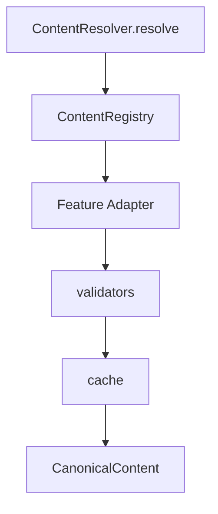

# Milestone 4.0 — Canonical Content Resolution Layer (Foundation)

## Summary

Adds a **read-only** `backend/services/content/` package that resolves ownership of kiosk content into a single `CanonicalContent` schema via adapters over **current** owners. **Nothing is wired** into production conversation, narration, WebSocket, PresentationEngine, or ChatScreen paths. User-visible behaviour is unchanged.

## Architecture

Existing kiosk path stays untouched. Future milestones may call `ContentResolver` from orch/narration; M4.0 does not.

## Resolve flow

1. Emit `CONTENT_RESOLVE_STARTED`
2. Resolve surface from `surface` / `requested_card` / FAQ question / intent→surface map (mirrors `card_trigger_hints` intents)
3. Registry lookup → `CONTENT_OWNER_SELECTED`
4. Adapter → `CONTENT_ADAPTER_USED`
5. Build SHA-256 content hash → validate → `CONTENT_VALIDATED` / `CONTENT_READY`
6. Optional in-process cache → `CONTENT_RETURNED`
7. Unknown surface / adapter miss / validation failure → `None` (no raise into production paths)

## Package layout

| File | Role |
|------|------|
| `types.py` | `CanonicalContent`, `ContentSection`, `ResolveRequest`, surface ids, `ContentType` |
| `registry.py` | Static map: surface → owner descriptor |
| `adapters.py` | One adapter per registry entry; reads **current** sources |
| `resolver.py` | `ContentResolver.resolve` — ownership only |
| `validators.py` | Required fields, section id uniqueness, hash check |
| `diagnostics.py` | Structured logger events (`CONTENT_*`) |
| `cache.py` | Optional in-process cache (disabled by default) |
| `__init__.py` | Public exports |

## CanonicalContent schema

Fields: `content_id`, `content_type`, `surface`, `language`, `language_code`, `title`, `subtitle`, `summary`, `sections` (tuple of `{id, title, body}`), `metadata`, `keywords`, `presentation_mode`, `canonical_source`, `version`, `hash`, `created_at`.

Hash: SHA-256 (truncated) over stable JSON of title/subtitle/summary/sections/language_code/surface/canonical_source.

## Registry (pointer-only; Phase 3.7 owners)

| Surface | Adapter | Current source (unchanged) |
|---------|---------|----------------------------|
| `department_overview` | department | Locale `departments[jkey]` |
| `department_fees` | fees | `narration_plan._FEES_AMOUNT_BY_KEY` / `_FEES_LABELS` |
| `documents` | documents | `DOCUMENT_ITEMS` / `DOCUMENT_TITLES` |
| `principal_profile` | principal | `EXEC_PRINCIPAL` |
| `vice_principal_profile` | vice_principal | `EXEC_VICE` |
| `hod` | hod | Locale `departments.*.hod_voice` |
| `placements` | placements | Locale `placements_and_training` |
| `admissions` | admissions | Locale `admissions_and_fees` |
| `trustees` | trustees | `static_cards.json` trustees |
| `college` | college | `static_cards.json` college |
| `department_comparison` | comparison | `department_comparison.json` |
| `bus_routes` | bus | `BUS_ROUTES_SPOKEN_PROMPT_BY_LANGUAGE` (routes JSON remains FE) |
| `course_menu` | course_menu | `COURSE_MENU_OPTIONS` + spoken prompt |
| `faq` | faq | `get_faq_answer_for_question` / faq JSON |

Known divergences (fees locale vs tables, documents KN drift, principal multi-owners, trustees count) are **documented in registry notes only** — not unified in M4.0.

## Explicit non-goals (M4.0)

- Do **not** call resolver from orch / `main.py` / ChatScreen / PresentationEngine
- Do **not** migrate or rewrite content owners
- Do **not** change CI / Runtime / ResponseAuthority / PresentationBundle / OutboundBuilder / WS
- Do **not** unify fees locale prose vs fee tables

## Future per-feature migration order (from Phase 3.7)

Suggested order when wiring begins: course options → FAQ → bus → placements → department → comparison → admissions → documents → VP → principal → HOD → trustees → college → **fees last**.

Each migration can swap a single adapter’s `canonical_source` without changing the resolver contract.

## Zero behaviour change

| Question | Answer |
|----------|--------|
| User-visible behaviour changed? | **NO** |
| Any feature migrated? | **NO** |
| Future one-feature migrations possible? | **YES** (swap adapter source later) |

## Architecture metrics (M4.0 target)

| Metric | Value |
|--------|-------|
| Resolver owners | 1 |
| Schema | 1 |
| Registry | 1 |
| Validators | 1 |
| Diagnostics | 1 |
| WS / PE / ChatScreen / CI / Runtime changes | 0 |
| Behaviour regressions | 0 |

## Tests

- `backend/tests/test_content_registry.py`
- `backend/tests/test_content_resolver.py` (includes no-production-import check)
- `backend/tests/test_content_validators.py`
- `backend/tests/test_content_hash.py`
